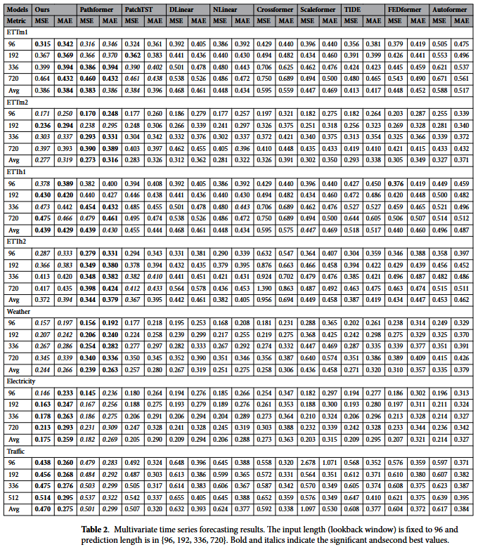

# MultiPatchFormer
Official Implementation of the MultiPatchFormer: A multiscale model for multivariate time series forecasting

Link of the paper:
https://www.nature.com/articles/s41598-024-82417-4

Results:

🚀 Usage

1. Clone the Repository
git clone https://github.com/bioinfoUQAM/MultiPatchFormer.git
cd MultiPatchFormer

2. Set Up the Environment
python -m venv venv
source venv/bin/activate  # On Windows: venv\Scripts\activate
pip install -r requirements.txt

3. Download the datasets and put it in the \data folder

4. Run the Model
Execute the training script using the provided shell scripts. For example:
bash scripts/weather.sh

